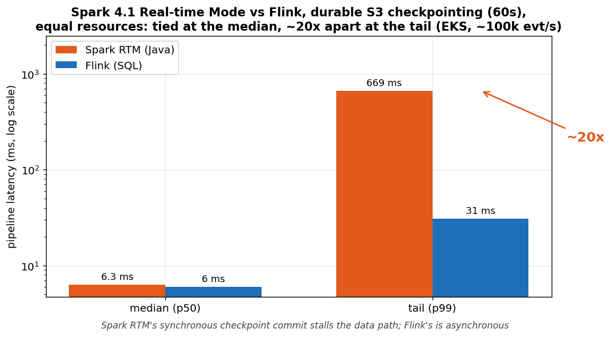
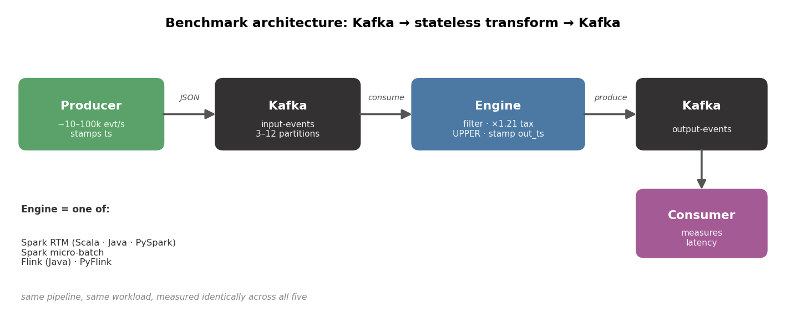
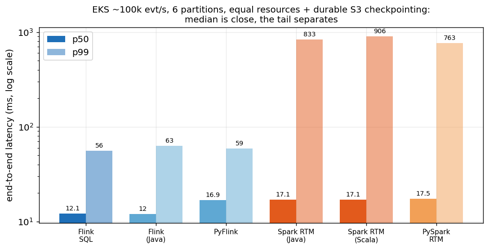
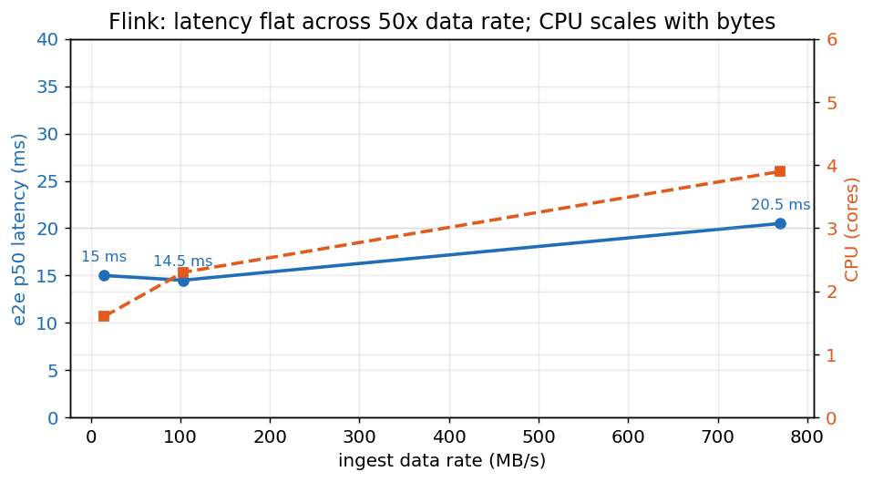
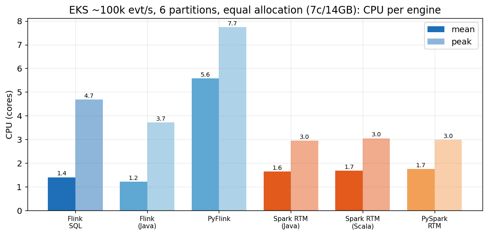
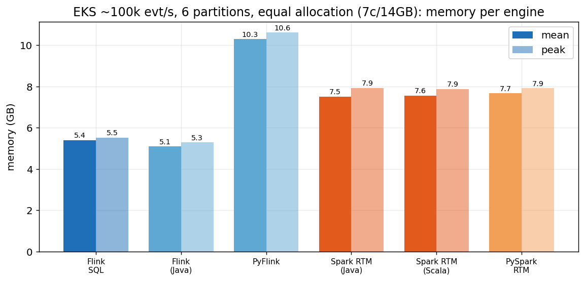
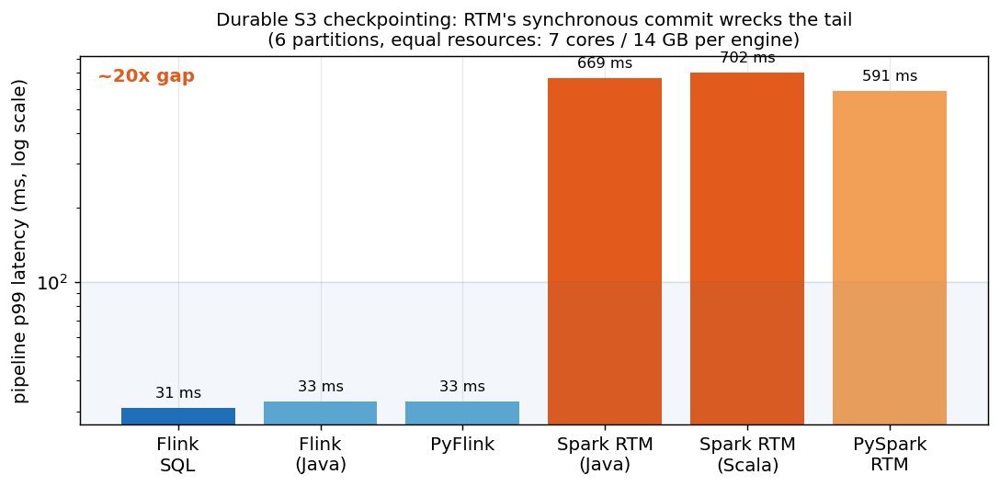
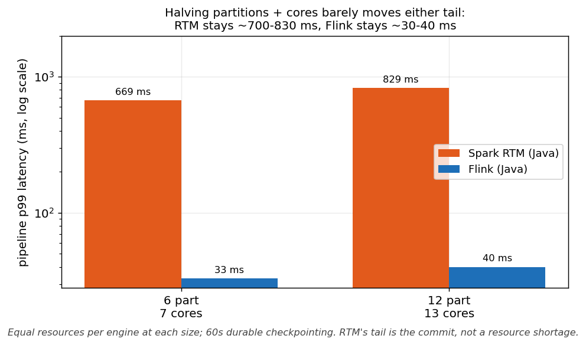
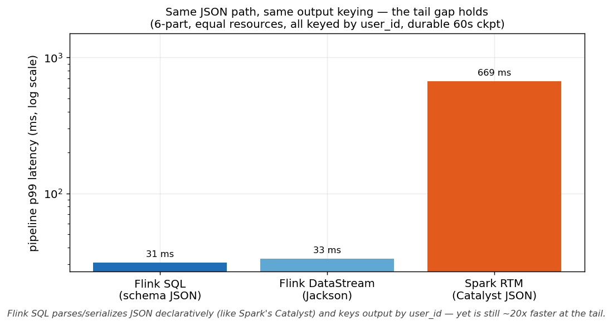
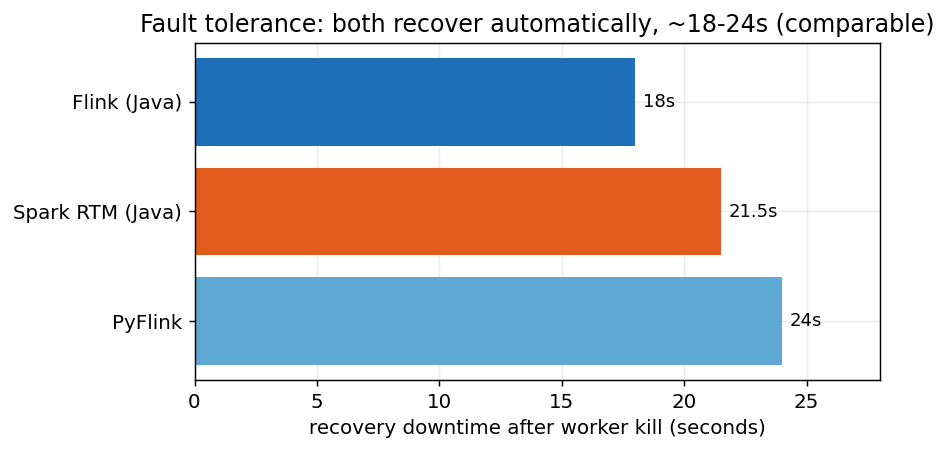

<!--
  MEDIUM UPLOAD NOTE: the  references point to local files.
  When pasting into Medium, upload each PNG from docs/charts/ at the matching spot.
  Charts (in order of appearance):
    00_hero.png (top)          07_architecture.png        01_rtm_vs_microbatch.png
    02_eks_matrix.png          04_datarate_sweep.png      08_cpu.png
    09_memory.png              03_checkpointing_tail.png  10_scaling_6v12.png
    11_json_path_control.png   06_recovery.png
  This comment block won't render in the published post.
-->

# Spark 4.1 Real-time Mode vs Flink: I Benchmarked Both to 100k events/sec

*Spark Structured Streaming has been a micro-batch engine its whole life. Spark 4.1 finally
changes that with Real-time Mode. I reproduced the claims, then put it head-to-head with
Flink on a laptop and a 100k-events/sec EKS cluster. Some of it surprised me.*



*All code, configs, and raw results are on GitHub:
[github.com/fmorillo7694/spark-rtm-vs-flink](https://github.com/fmorillo7694/spark-rtm-vs-flink)*

---

## The claim

Spark Structured Streaming wakes up on a trigger, processes a slice, commits, and sleeps.
That loop is also a latency floor. Even an "instant" trigger burns about 100ms per cycle,
so sub-100ms end-to-end was never really on the table.

Spark 4.1 introduces **Real-time Mode (RTM)**. Instead of the wake-sleep loop, it launches
long-running tasks (one per partition) that process records continuously. A write-up by
neuw84 reported median end-to-end latency in the tens of milliseconds on a laptop, and made
two claims I wanted to check:

1. RTM breaks the micro-batch floor: "100ms+ down to tens of ms."
2. On stable Spark 4.1.2 there's no native PySpark trigger yet. You reach RTM through a
   small py4j bridge. (The native `realTime=` kwarg only shows up in the 4.2.0.dev5 preview.)

Both claims are specific and reproducible, so I reproduced them. Then I asked the question
the original post skipped: how does this compare to Flink, which has done continuous
streaming all along? Not just on latency, but on CPU, memory, cost, and what happens when a
worker dies.

---

## Setup

One pipeline, run on every engine, measured the same way. It's deliberately stateless,
because that's all RTM supports today:

> Read JSON from Kafka, keep `purchase`/`add_to_cart` with `amount > 0`, compute
> `amount_with_tax`, uppercase `country`, stamp `out_ts`, write back to Kafka.

Each event carries `ts` (produce time) and each output carries `out_ts` (engine write
time). That gives two numbers. **Pipeline latency** is `out_ts − ts`, the engine's own work.
**End-to-end latency** is `consumer_read − ts`, which adds the output read.

The flow is the same for every engine:



I ran six variants to isolate the real variables:

| | Spark | Flink |
|---|---|---|
| JVM | Scala RTM, Java RTM | Java DataStream, Java SQL (Table API) |
| Python | PySpark RTM (py4j) | PyFlink (Table API) |

Plus Spark micro-batch as the baseline. The Flink SQL variant exists specifically to make
the JSON-handling path match Spark's (both schema-based and declarative) — I'll come back to
why that matters. Versions match the original post: Spark 4.1.2, Kafka 4.1.0 (KRaft, no
ZooKeeper), Flink 2.2.0. Docker locally, then real EKS.

One detail mattered more than I expected. I ran on Apple Silicon natively. The original
author ran amd64 under emulation. Hold that thought.

---

## Does RTM break the floor? Yes.

Same compiled job, two triggers:

| Spark mode (local, 10k evt/s) | e2e p50 | e2e p99 |
|---|--:|--:|
| micro-batch (default) | 50.0 ms | 80.4 ms |
| RTM (`Trigger.RealTime("5s")`) | **7.9 ms** | 42.1 ms |


That's a 6.3x cut at the median. The claim holds. My numbers even beat the original post,
which reported e2e p50 around 31ms and p99 around 2,040ms. The reason is the emulation I
mentioned. The author's two-second p99 was an artifact of running amd64 on Apple Silicon,
not a property of RTM. Running native, my p99 was 42ms. If you take one thing from this:
a laptop benchmark's harness can dominate its result.

The PySpark claims checked out word for word. On stable 4.1.2 the native `realTime=` kwarg
genuinely isn't there, and the py4j bridge genuinely works:

```python
jvm = spark._sc._jvm
rt = jvm.org.apache.spark.sql.streaming.Trigger.RealTime("5 seconds")
writer._jwrite.trigger(rt)     # -> RealTimeTrigger(5000). The query starts. It works.
```

So far, the original post holds up well. Going beyond it into a full engine comparison, I
hit a couple of things worth sharing for anyone benchmarking RTM themselves.

---

## A measurement gotcha: `current_timestamp()` under RTM

My first RTM run reported negative pipeline latency. The `out_ts` was landing about 2.3
seconds *before* `ts`. Time doesn't run backwards, so the timestamp was wrong.

Spark's `current_timestamp()` is frozen at the start of the batch. In micro-batch that's a
value a few milliseconds old, which is harmless. But an RTM "batch" is a long-running task
that can live for the whole trigger interval, so `current_timestamp()` returns the moment
the task launched, long before most rows pass through it.

The fix is to stamp each row with a real per-row clock:

```scala
// Scala: non-deterministic UDF, evaluated per row
val nowEpoch = udf(() => System.currentTimeMillis() / 1000.0).asNondeterministic()
```

```python
# PySpark: SQL reflect(), a per-row JVM call, no Python on executors
expr("CAST(reflect('java.lang.System','currentTimeMillis') AS DOUBLE) / 1000.0")
```

It's an easy one to miss: if you measure RTM write latency with `current_timestamp()`,
the numbers will be off without any obvious error. Worth flagging if you're setting up your
own measurements. (The end-to-end metric is unaffected, since it uses the consumer's own
clock — which is how I caught the discrepancy in the first place.)

---

## Adding Flink: tied at the median, not at the tail

For the Flink side I started with a straightforward DataStream job in Java (later I added a
Flink SQL variant too — more on why in the JSON-path section). The one tuning knob worth
calling out: Flink batches records into its network buffers and flushes them every 100ms by
default, which is fine for throughput but adds latency. Setting the buffer timeout to 0
(`env.setBufferTimeout(0)`) tells it to flush each record immediately. That's Flink's
low-latency *emit* setting — not, to be clear, a counterpart to RTM's trigger interval (a
different mechanism); the knob I hold matched across engines is the 60-second checkpoint
cadence, which is what the tail comparison turns on.

| Local, ~3.3k evt/s out | pipe p50 | pipe p99 | pipe max |
|---|--:|--:|--:|
| Spark RTM | 5.9 ms | 39.2 ms | 118 ms |
| Flink | 6.0 ms | 9.9 ms | 29 ms |

At the median they're a dead heat near 6ms. That's a genuinely strong result for Spark.
RTM matches a mature continuous engine on typical latency.

The tail is a different story. Flink's p99 is 4x tighter and its max is 4x lower. RTM's
long-running tasks still hitch periodically on checkpoint cadence, GC, and the offset
commit. Flink's continuous operators don't have that rhythm, so the distribution is flatter.
Flink also used less CPU and about 60% of Spark's memory.

---

## A PyFlink gotcha: the 456ms bundling cliff

The first PyFlink run came back at p50 = 456ms — forty times slower than everything else.
The engine wasn't slow, it was waiting.

PyFlink runs the filter and projection on the JVM, but my `out_ts` UDF round-trips each
record to a separate Python worker. To avoid shipping one record at a time, Flink bundles
records before sending them, and flushes a bundle when it hits either 100,000 records or
1,000ms. At 3k records a second we never hit the count, so every bundle waited the full
one-second timeout. The 456ms was just half that window on average.

One line fixed it:

```python
cfg.set_string("python.fn-execution.bundle.time", "1")   # 1ms instead of 1000ms
```

p50 dropped to 7.2ms. So PyFlink with Python UDFs has a latency trap you have to tune your
way out of. The JVM engines have no such layer.

---

## The full matrix at 100k/sec on EKS

A laptop is a laptop. So I built a real cluster and ran the same six engines on it. For
transparency, here's exactly what it was:

**Cluster — Amazon EKS (Kubernetes 1.31):**
- **6 × m5.2xlarge** worker nodes = **48 vCPU / 192 GiB** total
- 100 GiB gp3 EBS per node; nodes in private subnets
- Spark-on-Kubernetes operator + Flink Kubernetes operator

**Kafka — Strimzi, 3 brokers (KRaft, no ZooKeeper):**
- replication factor 3, min in-sync replicas 2, producer acks=1
- input + output topics, **6 partitions** each
- broker storage on gp3 EBS

**Per-engine resource allocation — identical for every engine, so the comparison is fair:**

| layout (per engine) | total cores | total memory | parallelism |
|---|--:|--:|--:|
| 1 coordinator (1 core / 2 GB pod) + 2 workers (3 cores / 6 GB pod) | **7** | **14 GB** | 6 |

> **Fairness, taken seriously.** Every engine gets byte-for-byte the same envelope: 7 cores,
> 14 GB, parallelism 6, one core per partition. "Coordinator/worker" is generic on purpose —
> it's driver + executors on Spark, JobManager + TaskManagers on Flink. I matched the *pod*
> memory exactly (Spark's pod = `executor.memory` + `memoryOverhead`, so I split it
> `5120m + 1024m` to equal Flink's `6144m` TaskManager pod — otherwise the operator quietly
> hands Spark more). Output is keyed by `user_id` on every engine, and the checkpoint interval
> is pinned at 60 s on both sides. (An earlier version of this post accidentally gave Spark 17
> cores to Flink's 10; this is the corrected, equal run.)

The producer ran as **8 pods** pushing ~100k events/sec aggregate. The filter passes about a
third, so each engine processed ~33k records/sec and roughly **10 million records per run** over
a five-minute steady-state window. The "CPU / mem" columns in the results below are the
*measured* steady-state usage within those allocations — not the allocation ceilings.

Every engine here runs with **durable S3 checkpointing on** — the only way you'd run
streaming in production, since without it a worker failure loses data. All six write
checkpoints to the same S3 bucket at the same 60-second interval. These are the numbers that
matter:

| Engine (~33k/s out, durable S3 checkpointing @ 60s) | pipe p50 | pipe p99 | mean CPU | mean mem |
|---|--:|--:|--:|--:|
| Flink SQL | 6.0 ms | **31 ms** | **1.4 cores** | **5.4 GB** |
| Flink (Java) | 6.0 ms | **33 ms** | **1.2 cores** | **5.1 GB** |
| PyFlink | 8.8 ms | **33 ms** | 5.6 cores | 10.3 GB |
| Spark RTM (Java) | 6.3 ms | **669 ms** | 1.6 cores | 7.5 GB |
| Spark RTM (Scala) | 6.2 ms | **702 ms** | 1.7 cores | 7.6 GB |
| PySpark RTM | 6.2 ms | **591 ms** | 1.7 cores | 7.7 GB |

*(CPU/mem are mean steady-state usage, not the allocation ceilings — see the per-engine
charts below.)*



A few answers fall straight out of this table.

**At the median, everyone's fast** — 6–9 ms. RTM genuinely keeps pace with Flink on
typical latency, which is the real story for Spark. The separation is entirely in the tail
(more on that in a moment).

**Java versus Scala for Spark makes no difference.** Java RTM and Scala RTM are
statistically the same (669 vs 702 ms) — both compile to the same JVM plan, both in the same
hundreds-of-milliseconds tail band. I wrote a full Java DataFrame RTM job specifically to
confirm this rather than assume it. Pick whichever your team prefers.

**Python versus Python is a real trade.** PySpark runs no Python on the data path (it's only
the driver), so it tracks the JVM Spark RTM jobs (591 ms, ~1.7 cores). PyFlink pays for its
per-record Python worker in CPU (~5.6 cores), but its tail (33 ms) stays right with Java Flink's.

I also swept the data rate by padding the payload, holding the record count fixed:

| payload | ingest rate | Flink e2e p50 | CPU |
|---|--:|--:|--:|
| 150 B | ~15 MB/s | 15.0 ms | 1.6 cores |
| 1 KB | ~103 MB/s | 14.5 ms | 2.3 cores |
| 8 KB | ~770 MB/s | 20.5 ms | 3.9 cores |



Flink's median held flat across a 50x increase in data rate. CPU scaled with bytes, latency
didn't. Pushing toward 1 GB/s, the first thing to break wasn't the engine, it was Kafka
storage. Three brokers on gp3 EBS top out around 375 MB/s aggregate write after replication.
Real 1 GB/s needs more brokers or faster volumes, not a faster engine.

And on efficiency, the clear win is memory: Flink does the same work on **~60% of Spark RTM's
memory at comparable CPU**. Here's what each engine drew at the same ~33k records/sec
throughput:





Flink ran on ~5 GB; the JVM Spark RTM jobs needed ~7.5 GB for the identical workload — a durable
~30% memory saving. On CPU the JVM engines are close to a tie (Flink ~1.2–1.4 cores, Spark RTM
~1.6–1.7), so I won't overstate it: the efficiency story is memory, not cores. PyFlink is the
exception — it pays for its per-record Python worker in CPU (~5.6 cores), though it stays
reasonable on memory. All six numbers, PySpark included, are measured from the engines' own
pods (the resource sampler now matches PySpark's `rtm-pyspark-measured` executors correctly).

---

## Why the tail diverges ~20x

The median is a tie, but the p99 gap in that table is large — Flink around 31–33 ms, Spark RTM
around 600–700 ms. That difference is all about *how each engine checkpoints*.



Spark RTM commits its offsets to durable storage **synchronously**, and that commit stalls
the data path. At each checkpoint the tail spikes into the hundreds of milliseconds. All
three RTM variants do it — the median stays around 6 ms, but the p99 takes the hit. Flink
checkpoints **asynchronously**, so its tail barely moves: the checkpoint runs in the
background while records keep flowing.

So at production-grade durability with a matched 60-second checkpoint interval and identical
resources, Spark RTM's tail latency is roughly **20x worse** than Flink's. That's the single
biggest separator between the two for real workloads — and it only shows up once you turn on
the fault tolerance you'd never ship without. (Worth noting: RTM's tail scales with how
*often* it checkpoints — commit more frequently and the tail rises, since each synchronous
commit is a stall.)

### Is it just a resource thing? No.

The obvious objection is that RTM's tail is a capacity problem — give it more cores and it'll
smooth out. It doesn't. I also ran the whole matrix at double the size — 12 partitions and 13
cores per engine instead of 6 and 7 — and the picture is the same:



RTM's tail sits at ~670 ms on 7 cores and ~830 ms on 13 — essentially flat, because the
synchronous commit is a fixed stall that doesn't care how much hardware is behind it.
Flink's tail actually gets *tighter* with fewer partitions (33 ms vs 40 ms), since there's
less checkpoint coordination across subtasks. More hardware doesn't fix RTM's tail; it isn't
a throughput bottleneck, it's the commit on the data path.

### Is it the JSON parser, or the output keying? No.

A sharp reader pushed back on an earlier version of this benchmark, and the critique was fair
enough that it's worth answering in the open. Two of the points: my Spark job parsed JSON
through Spark SQL's schema-based `from_json`/`to_json` (Catalyst), while my Flink DataStream
job parsed it by hand with Jackson — so was I partly benchmarking two JSON libraries? And
Spark keyed its Kafka output by `user_id` while Flink wrote value-only records — different
partitioning. Both true.

So I removed both differences and re-ran. First, the Flink DataStream job now keys its output
by `user_id`, exactly like Spark. Second — and this is the real control — I wrote a **Flink
SQL (Table API)** variant that parses and serializes JSON declaratively through Flink's
schema-based `json` format. That's the direct structural analogue of Spark's Catalyst path:
no hand-rolled Jackson, a schema-driven parse, output keyed by `user_id`, and everything on
the JVM. If the tail gap were really about JSON parsing or keying, making all three match
should collapse it.



It doesn't move. With identical resources and durable checkpointing, the three JVM jobs look
like this — same throughput (~33k records/sec), same allocation, all keyed by `user_id`:

| 6-part, equal resources, all keyed by user_id | pipe p99 | mean CPU | mean mem |
|---|--:|--:|--:|
| Flink SQL (schema-based JSON, Catalyst analogue) | **31 ms** | 1.4 cores | **5.4 GB** |
| Flink DataStream (Jackson) | 33 ms | 1.2 cores | **5.1 GB** |
| Spark RTM (Java, Catalyst) | **669 ms** | 1.6 cores | 7.5 GB |

Flink SQL — same declarative JSON path and same keying as Spark — is still ~20x faster at the
tail, on the same CPU and ~70% of the memory. Keying the Flink output cost it only a handful of
milliseconds, nowhere near RTM's half-second. The gap isn't the parser and it isn't the
key — it's the synchronous checkpoint commit, exactly as the resource sweep showed.

One more fair point from that same reader: Flink's `bufferTimeout(0)` and Spark RTM's trigger
duration aren't the same kind of knob — one is a per-record network flush, the other is a
checkpoint cadence. That's right, and I don't equate them. `bufferTimeout(0)` is simply each
engine's low-latency setting for *emitting* records; the thing I hold *matched* across engines
is the **checkpoint interval**, pinned at 60 s on both sides. The tail comparison is
checkpoint-to-checkpoint, like for like.

(And to close the loop on memory, raised in the same review: on EKS every engine gets the same
*container-total* memory limit — 14 GB — not a heap-only number, so there's no hidden overhead
asymmetry. The local Docker configs have been squared up the same way.)

### The twist: on a laptop, RTM's tail vanishes

Here's the most interesting thing I found, and the one that makes me trust the EKS result
*more*, not less. I ran the identical six-engine matrix locally too — same transform, same
6 partitions, equal 6 cores / 3 GB per engine, same 60 s checkpoints, keyed output — but on a
single laptop at 10k events/sec instead of a cluster at 100k:

| Local, 6-part, equal resources (10k evt/s) | pipe p50 | pipe p99 |
|---|--:|--:|
| Flink (Java) | 5.6 ms | **8.1 ms** |
| Flink SQL | 6.0 ms | **8.9 ms** |
| PySpark RTM | 5.7 ms | **8.6 ms** |
| Spark RTM (Scala) | 6.3 ms | **9.4 ms** |
| PyFlink | 7.1 ms | **12.5 ms** |
| Spark micro-batch | 46.1 ms | **78.1 ms** |

Locally, **RTM's tail is gone** — 9 ms, neck-and-neck with Flink. The ~600 ms tail only
appears on EKS. Why? Because the tail is the *synchronous checkpoint commit*, and what you're
committing to changes everything. Locally the checkpoint writes to a fast local disk at 10k/s;
on EKS it's a synchronous round-trip to **durable S3 at 100k/s**. That S3 commit is the stall.

So RTM's tail penalty is real but **conditional**: it shows up exactly where production lives —
durable remote storage under real load — and disappears on a laptop. If you benchmark RTM
locally and conclude "the tail is fine," you've measured the wrong thing. (The local run still
cleanly reproduces the headline RTM-vs-micro-batch win, though: 9 ms vs 78 ms, the ~6x cut the
original post claimed.)

### Killing a worker

I killed an executor and a taskmanager mid-stream and let the operators recover from the
checkpoint.

| Worker killed (operator restart) | recovery downtime |
|---|--:|
| Flink (Java) | ~18 s |
| Spark RTM (Java) | ~21.5 s |
| PyFlink | ~24 s |



Both engines recover automatically, and they land in the same ballpark, around 18 to 24
seconds. Neither is dramatically better. Recovery is dominated by detecting the failure,
re-acquiring the slot, and restoring from the checkpoint.

I'll be honest about a wrong turn here, because it's instructive. An earlier local test of
mine reported RTM recovering in 129ms, which looked too good. It was — I'd killed a
partly-idle worker, so nothing critical actually had to recover. Once I forced the kill onto
the worker holding the partition tasks, with a real S3 checkpoint to restore from, RTM
stalled about 21 seconds — same ballpark as Flink. A recovery number is meaningless unless
the dead worker was actually doing the work and the checkpoint is durable.

Both sinks are at-least-once here (no exactly-once sink configured), so both replay and
re-emit the in-flight window on recovery.

---

## What else RTM can't do yet

Beyond "no stateful operations until ~Spark 4.3," the stateless scope in 4.1 has sharp
edges worth knowing:

- Output mode is `update` only. Append and complete are rejected at startup.
- Source is Kafka only. No rate, file, or socket sources.
- `foreachBatch` is not supported.
- Delivery is at-least-once. There's no exactly-once sink yet.
- Stream-stream joins aren't supported. Stream-static is, if the static side broadcasts.
- Watermarks are accepted but do nothing.
- Effectively one RTM query per cluster, since it holds its task slots continuously.
- The trigger interval is a checkpoint cadence, not a latency target. Records still flow in
  milliseconds with a 5-second trigger.

None of these blocked a stateless Kafka-to-Kafka pipeline, but they define the box RTM lives
in today.

---

## So, which one?

The original claim is true. RTM is a real, large latency win over micro-batch, around 8ms
median versus 50ms, and its stated caveats are accurate. The scary tail in the original post
was emulation, not RTM.

Against Flink, the story is consistent from laptop to a 100k/sec cluster:

- At the median, RTM ties Flink. If median latency is your bar and you're on Spark already,
  RTM is a genuine option today, and PySpark costs almost nothing over Scala or Java.
- On tail latency under durable S3 checkpointing at scale — i.e. any real production setup —
  Flink wins by roughly 20x (matched 60s checkpoint interval, identical resources, output
  keyed the same), because its checkpoint is asynchronous and RTM's is synchronous. That gap
  holds at both 6 and 12 partitions, so it isn't a capacity artifact — but note it's a
  *durable-storage-at-scale* effect: on a laptop with local-disk checkpoints, the tail closes.
- On efficiency, Flink does the same work on ~70% of Spark RTM's memory, at comparable CPU.
- On recovery from a dead worker, they're comparable, around 20 seconds each.

The deepest deciding factor isn't in any latency table. It's state. This benchmark is
stateless because that's all RTM does today. Stateful RTM, the aggregations and joins and
windows, is targeted for a later release. Flink does stateful streaming now, and well.

If your workload is stateless, you can tolerate one checkpoint of replay, and you're already
invested in Spark, RTM is a legitimate, today-ready choice. If you need a tight tail under
durable fault tolerance, lower cost, or anything stateful, Flink is still the stronger
engine. The genuinely new thing is that Spark, the micro-batch engine, is in the real-time
conversation at all.

---

## Run it yourself

Everything is on GitHub: **github.com/fmorillo7694/spark-rtm-vs-flink** — a one-command path
per engine, the full methodology, every raw result, and the security baseline for the EKS
manifests:

```bash
# Local (Docker)
bench/run_spark.sh rtm
bench/run_spark.sh microbatch
bench/run_pyspark.sh
bench/run_flink.sh
docker build -t pyflink-bench:2.2.0 flink/pyflink/ && bench/run_pyflink.sh
.venv/bin/python bench/analyze.py

# EKS (~100k/s), tears down after
eks/01_create_cluster.sh        # edit cluster.yaml placeholders first
eks/02_install.sh
eks/03_build_push_images.sh
eks/04_run_benchmark.sh flink   # and spark-rtm-java, spark-rtm-scala, pyspark-rtm, pyflink
eks/05_chaos.sh spark-rtm-java  # fault-tolerance test
eks/99_teardown.sh
```

Benchmarks are environment-specific. The absolute numbers will differ on your hardware, but
the relative shape should hold. Run it on your own workload before you decide anything.
