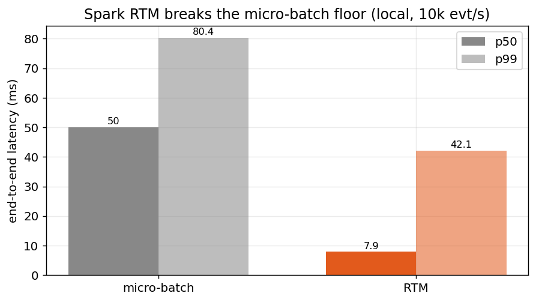

# Spark 4.1 Real-time Mode (RTM) vs Apache Flink — reproducible benchmark

Validates the claims in the Medium post *"Spark RTM Mode: low-latency streaming
pipelines"* (neuw84) and runs the **identical** stateless Kafka → transform → Kafka
pipeline on **Apache Flink 2.2**, comparing **latency, CPU, memory, cost, and fault
tolerance** across six engine variants — locally in Docker and on a production EKS
cluster at ~100k events/sec.

**Headline results** (full write-up in [`REPORT.md`](REPORT.md)):

- RTM is real: it cuts median end-to-end latency from the micro-batch floor (~50 ms) to
  **~8 ms**, a 6.3× win.
- At the median RTM ties Flink (~6 ms). On the **tail**, Flink wins — and the gap only opens
  under **durable S3 checkpointing at scale**: on EKS at ~100k/s, RTM's synchronous offset
  commit spikes p99 to ~600–700 ms while Flink's async checkpoint stays ~31–33 ms — a **~20×
  gap** (~30× at 12 partitions). A Flink **SQL** variant with Spark's *exact* schema-based JSON
  path + same keying still shows the gap, so it isn't the parser. Locally (local-disk
  checkpoints, 10k/s) RTM's tail collapses to ~9 ms — the penalty is durable-storage-at-scale.
- Flink does the same work on **~70% of Spark RTM's memory, at comparable CPU**.
- Java ≡ Scala for Spark (same JVM plan). On worker loss, both recover in a comparable
  **~18–24 s**.



## What's compared (6 engine variants)

| variant | engine | language | role |
|---|---|---|---|
| `spark-rtm` | Spark 4.1.2, `Trigger.RealTime("5s")`, update mode | Scala 2.13 | the claim under test |
| `spark-microbatch` | Spark 4.1.2, default trigger | Scala 2.13 | the latency floor RTM beats |
| `pyspark-rtm` | Spark 4.1.2 RTM via py4j bridge | Python | Python-vs-JVM on Spark |
| `flink` | Flink 2.2.0 DataStream, `bufferTimeout(0)`, keyed by `user_id` | Java 17 | the comparison engine |
| `flink-sql` | Flink 2.2.0 Table API/SQL, schema-based `json` format, keyed by `user_id` | Java 17 | JSON-path-matched to Spark's Catalyst |
| `pyflink` | Flink 2.2.0 Table API, tuned bundle | Python | Python-vs-JVM on Flink |

On EKS a **Java** Spark RTM job (`spark-rtm-java`) is added too, so the JVM comparison is
Java-on-both. The `flink-sql` variant uses Flink's declarative schema-based JSON (the
structural analogue of Spark's `from_json`/`to_json`) so the JSON-handling path matches Spark,
isolating the engine from the parser implementation. All run the same transform on the same
event (see
[`common/event_schema.md`](common/event_schema.md)): keep `purchase`/`add_to_cart` with
`amount>0`, add `amount_with_tax = amount*1.21`, uppercase `country`, stamp `out_ts`,
carry `ts` through for latency measurement.

---

# Part 1 — Local benchmark (Docker)

Runs on a laptop. Stacks run **sequentially** to fit in ~8 GB; Kafka is shared and stays
up between engines.

## 1.1 Prerequisites

| tool | version used | check |
|---|---|---|
| Docker (≥ 8 GB RAM allocated) | 29.x | `docker info \| grep Memory` |
| `sbt` (Scala build) | 1.10 | `sbt --version` |
| Maven (Java/Flink build) | 3.9 | `mvn -version` |
| Python 3 | 3.9+ | `python3 --version` |

```bash
# from the repo root
python3 -m venv .venv
.venv/bin/pip install -r common/requirements.txt   # confluent-kafka
```

> Apple Silicon or x86 both work (images are multi-arch). We ran native arm64 — relevant
> because the original post's amd64-under-emulation run is what produced its fat tail.

## 1.2 Run an engine

Each `bench/run_*.sh` does the whole cycle: brings up the stack → builds the jar →
submits the job → runs the producer (`TARGET_RATE` evt/s for `RUN_SECONDS`, both in
`.env`) while a latency consumer and a `docker stats` sampler record results → tears the
engine down. Kafka stays up.

```bash
bench/run_spark.sh rtm          # Spark Real-time Mode      -> results/spark-rtm_*
bench/run_spark.sh microbatch   # the floor RTM beats       -> results/spark-microbatch_*
bench/run_pyspark.sh            # PySpark RTM (py4j bridge)  -> results/pyspark-rtm_*
bench/run_flink.sh              # Java DataStream (keyed)    -> results/flink_*
bench/run_flink_sql.sh          # Java SQL / Table API       -> results/flink-sql_*

docker build -t pyflink-bench:2.2.0 flink/pyflink/   # one-time image build (~5 min)
bench/run_pyflink.sh            # PyFlink Table API          -> results/pyflink_*
```

**What you'll see** (per run, ~3–4 min): compose pulling/starting containers, a build log,
`[RtmPipeline] mode=rtm ... trigger=RealTime(5 seconds)` (or the Flink JobID), then a
1-second-cadence producer/consumer progress, ending in a `LATENCY SUMMARY` JSON block like:

```json
{
  "engine": "spark-rtm", "throughput_eps": 3326.6,
  "pipeline_ms": { "p50": 5.9, "p95": 8.6, "p99": 39.2, "max": 118.3 },
  "e2e_ms":      { "p50": 7.9, "p95": 11.1, "p99": 42.1, "max": 120.8 }
}
```

Artifacts land in `results/<engine>_{latency.csv,summary.json,stats.csv}`.

## 1.3 Build the comparison tables

```bash
.venv/bin/python bench/analyze.py        # local 5-engine latency + CPU/mem + cost tables
```

## 1.4 Validate the PySpark py4j-bridge claim

Shows the native `realTime=` kwarg is absent on stable 4.1.2 and the py4j bridge works.
Spark stack must be up:

```bash
docker compose -f docker-compose.kafka.yml -f docker-compose.spark.yml up -d
docker exec -e HOME=/opt/spark -e PYSPARK_PYTHON=python3 spark-jupyter \
  /opt/spark/bin/spark-submit \
  --packages org.apache.spark:spark-sql-kafka-0-10_2.13:4.1.2 \
  --conf spark.jars.ivy=/opt/spark/.ivy2 \
  /workspace/spark/pyspark-bridge/rtm_pyspark_measured.py
```

Expected: `native realTime= kwarg present? False` then
`py4j Trigger.RealTime('5 seconds') -> RealTimeTrigger(5000)` and a live query id.

## 1.5 Fault-tolerance test (local)

```bash
bench/chaos_flink.sh java     # kill a Flink taskmanager mid-stream, measure recovery
bench/chaos_spark.sh          # kill the Spark worker holding the partition tasks
```

These print recovery downtime + duplicate counts. (See the EKS chaos test for the
production-correct version with durable checkpoints + operator restart.)

## 1.6 Local troubleshooting

| symptom | cause / fix |
|---|---|
| `mkdir of file:/tmp/spark-checkpoints ... failed` | checkpoint dir not writable — the run scripts `chmod 777` it on each node; re-run |
| `--packages` download fails / Ivy error | Spark image runs with `HOME=/nonexistent`; scripts set `HOME=/opt/spark` + `spark.jars.ivy` |
| `maxOffsetsPerTrigger is not compatible with real time mode` | RTM rejects it; only micro-batch sets it (already handled) |
| negative pipeline latency | `current_timestamp()` is frozen under RTM — the jobs stamp `out_ts` per-row instead (see REPORT §7) |
| PyFlink p50 ~456 ms | Python UDF bundle floor — `python.fn-execution.bundle.time=1` fixes it (already set) |
| producer < target rate | bump Docker CPU, or lower `TARGET_RATE` in `.env` |

---

# Part 2 — Scale-out on AWS EKS (~100k evt/s)

The same jobs on a production cluster: 6× m5.2xlarge, Strimzi Kafka (3 brokers, KRaft),
the Spark-on-K8s and Flink Kubernetes operators, durable S3 checkpoints, 8 producer pods.
Full detail and the security baseline in [`eks/README.md`](eks/README.md).

> ⚠️ **This creates billable AWS resources** (EKS + nodes + S3). `eks/99_teardown.sh`
> removes them. Edit the `<YOUR_*>` placeholders in `eks/cluster.yaml` first.

```bash
export AWS_PROFILE=your-profile

eks/01_create_cluster.sh        # EKS cluster (~18 min). Writes a dedicated eks/kubeconfig.
eks/02_install.sh               # metrics-server + Strimzi(3-broker Kafka) + operators
eks/02b_irsa_s3.sh              # IRSA so Spark/Flink can write checkpoints to S3
eks/03_build_push_images.sh     # build + push engine images to ECR

# Steady-state matrix (each: deploy → 100k/s load → latency + CPU/mem + backlog → clean)
eks/04_run_benchmark.sh flink
eks/04_run_benchmark.sh spark-rtm-java
eks/04_run_benchmark.sh spark-rtm-scala
eks/04_run_benchmark.sh pyspark-rtm
eks/04_run_benchmark.sh pyflink

# Equal-resource matrix (identical cores/mem per engine, durable 60s checkpoints).
# 04c = 12 partitions/parallelism 12; 04b = 6 partitions/parallelism 6.
# Engines: spark-rtm-java | spark-rtm-scala | pyspark-rtm | flink | flink-sql | pyflink
eks/04c_run_p12eq.sh flink-sql      # JSON-path-matched Flink, 12-part
eks/04b_run_p6.sh    flink-sql      # JSON-path-matched Flink, 6-part

# Fault tolerance (kill a worker pod mid-stream, operator restarts from checkpoint)
eks/05_chaos.sh flink
eks/05_chaos.sh spark-rtm-java

.venv/bin/python bench/analyze_eks.py    # EKS comparison tables

eks/99_teardown.sh              # delete cluster, ECR, S3, KMS — leaves shared VPC intact
```

**Isolation note:** all EKS scripts pin `KUBECONFIG=eks/kubeconfig` so they never touch
your shared `~/.kube/config` (important if another cluster/session is active).

---

## Key charts

| | |
|---|---|
| EKS 5-engine matrix | `docs/charts/02_eks_matrix.png` |
| **Durable-checkpoint tail blowup** | `docs/charts/03_checkpointing_tail.png` |
| Data-rate sweep (flat latency) | `docs/charts/04_datarate_sweep.png` |
| CPU/memory efficiency | `docs/charts/05_efficiency.png` |
| Recovery downtime | `docs/charts/06_recovery.png` |

Regenerate with `.venv/bin/python bench/make_charts.py`.

## Layout

```
docker-compose.{kafka,spark,flink,pyflink}.yml   local stacks
.env                            versions, topics, load profile
common/                         producer.py, latency_consumer.py, event_schema.md
spark/scala-rtm/                Scala RTM/micro-batch pipeline (sbt)
spark/java-rtm/                 Java RTM pipeline (Maven)
spark/pyspark-bridge/           measured PySpark RTM job (py4j bridge)
flink/java-datastream/          Java DataStream pipeline (Maven shade)
flink/pyflink/                  PyFlink Table API job + image
bench/                          run_*.sh, chaos_*.sh, analyze*.py, make_charts.py
eks/                            cluster + operators + jobs + chaos + teardown (IaC)
results/                        summaries, stats, consumer logs, findings
docs/charts/                    generated PNG charts
REPORT.md                       the full written-up comparison (local §1–8, EKS §9–10)
```

## Results

See **[`REPORT.md`](REPORT.md)** for the complete write-up and **`results/`** for raw data
(`results/eks/` for the cluster run, including `CHECKPOINTED_findings.md`).
